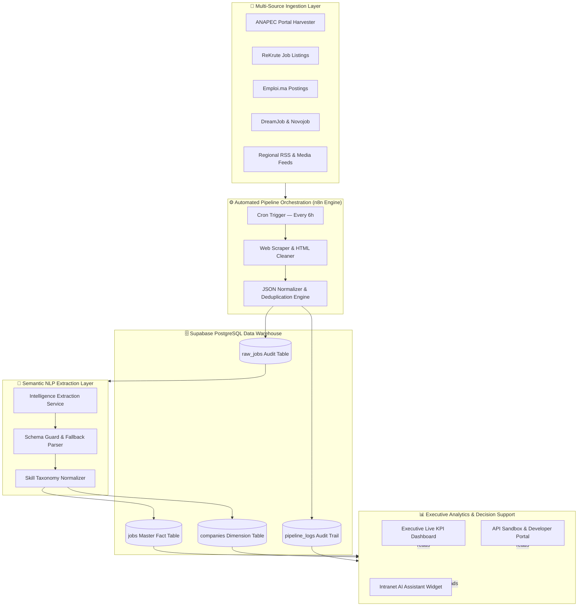
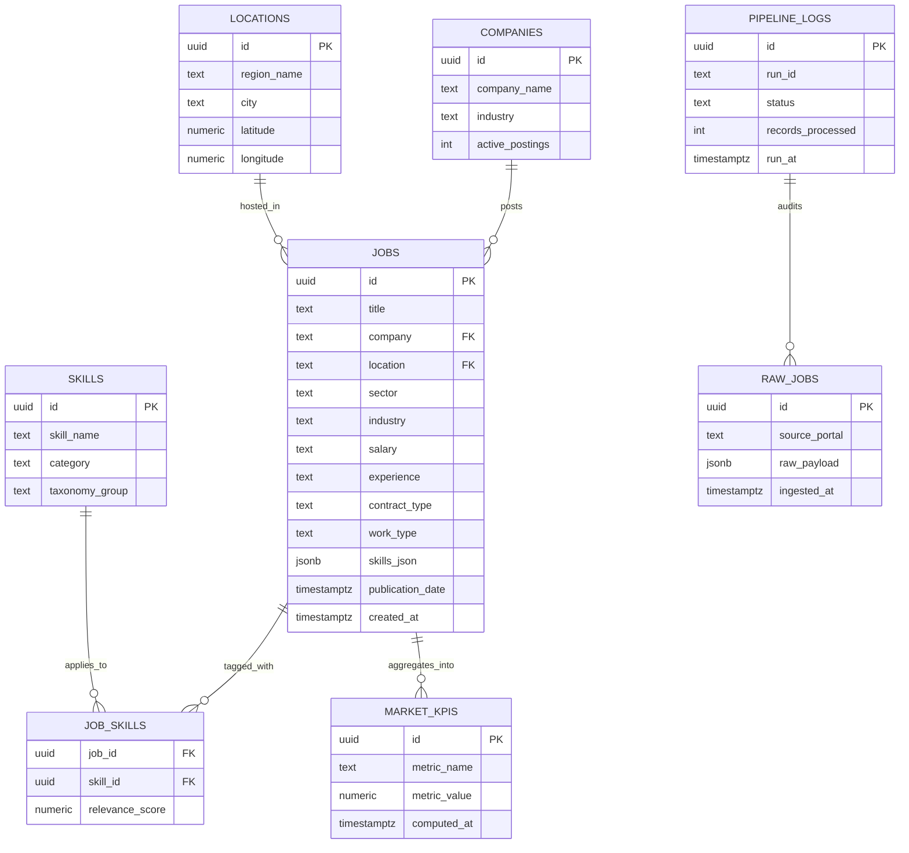
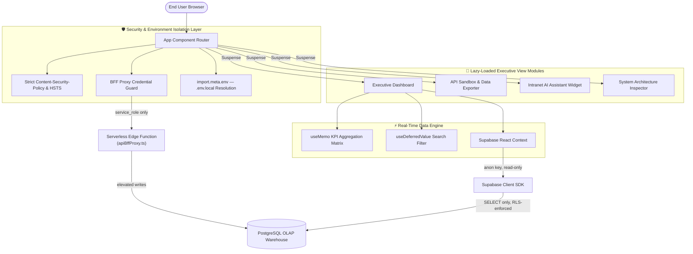
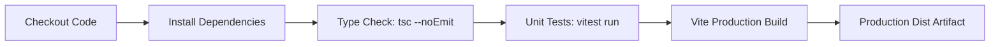

# 🚀 MOROCCO EMPLOYMENT INTELLIGENCE PLATFORM (MEIP)

<div align="center">

[](https://github.com/meip/solana-breakpoint-2026/actions)
[](https://react.dev/)
[](https://www.typescriptlang.org/)
[](https://vitejs.dev/)
[](https://tailwindcss.com/)
[](https://supabase.com/)
[](#-continuous-integration--deployment-cicd)
[](#-security-protocol--environment-isolation)

**An enterprise-grade, automated data-ingestion, semantic skill-extraction, and real-time analytical platform capturing, structuring, and visualizing national labor market dynamics across all 12 regions of the Kingdom of Morocco.**

</div>

---

## 📖 Table of Contents

1. [Executive Overview](#-executive-overview)
2. [Enterprise System Architecture](#-enterprise-system-architecture--data-flow)
3. [Security Protocol & Environment Isolation](#-security-protocol--environment-isolation)
4. [Database Architecture & Indexing Strategy](#-database-architecture--indexing-strategy)
5. [Deep-Dive Feature Architecture Matrix](#-deep-dive-feature-architecture-matrix)
6. [Local Setup & CLI Deployment Guide](#-local-setup--cli-deployment-guide)
7. [Continuous Integration & Deployment](#-continuous-integration--deployment-cicd)
8. [System Benchmarks & Maintenance Matrix](#-system-benchmarks--maintenance-matrix)
9. [License & Contact](#-license--contact)

---

## 💡 Executive Overview

The **Morocco Employment Intelligence Platform (MEIP)** bridges information asymmetry in the North African recruitment ecosystem by aggregating live job postings across leading public and private employment portals (**ANAPEC, ReKrute, Emploi.ma, DreamJob, Novojob**).

Driven by an **Automated NLP Engine** and **n8n workflow orchestration**, MEIP standardizes unstructured job listings into a high-performance **Supabase PostgreSQL Data Warehouse** (OLAP Star Schema). The platform feeds an interactive executive analytics dashboard delivering sub-second salary distributions, ICT skill demand matrices, regional employment density heatmaps, and enterprise recruitment benchmarks.

```
       +-------------------------------------------------------------------------+
       |             Morocco Employment Intelligence Platform (MEIP)             |
       +-------------------------------------------------------------------------+
       |                                                                         |
       |  [ Multi-Portal Aggregation ]  -->  [ Semantic NLP Extraction Layer ]   |
       |         ANAPEC / ReKrute                 Automated Skill Categorization |
       |                                                         |               |
       |                                                         v               |
       |  [ Executive Dashboard UI ]   <--  [ Supabase OLAP Data Warehouse ]    |
       |    React 18 + Dynamic Imports              PostgreSQL + RLS Security    |
       |                                                                         |
       +-------------------------------------------------------------------------+
```

### Core Value Pillars

| Pillar | Description |
| :--- | :--- |
| 🌍 **National Coverage** | Ingests postings across all 12 administrative regions of Morocco |
| ⚡ **Real-Time Intelligence** | Sub-second aggregate queries over 24,000+ normalized job records |
| 🧠 **Semantic Understanding** | Automated skill-taxonomy extraction from unstructured listing text |
| 🔒 **Zero-Trust Security** | Strict RLS enforcement, credential isolation, and BFF proxy patterns |

---

## 🏗️ Enterprise System Architecture & Data Flow

### 1. End-to-End Automated Data Pipeline



### 2. Database Entity-Relationship Diagram



### 3. BFF & Security Boundary Architecture



> **Boundary Principle:** Client-side code never holds elevated credentials. All mutating operations are routed exclusively through the BFF edge proxy, which resolves `service_role` secrets server-side and is never exposed to the browser bundle.

---

## 🔒 Security Protocol & Environment Isolation

MEIP enforces strict zero-trust security practices across both frontend assets and backend edge proxies. No Supabase credentials, backend URLs, or secret keys are ever hardcoded into source, markdown, or config files — every sensitive value is resolved exclusively through `.env.local`.

| # | Control | Implementation Detail |
| :--- | :--- | :--- |
| 1 | **Zero Client Credentials Leakage** | Supabase configuration (`VITE_SUPABASE_URL`, `VITE_SUPABASE_ANON_KEY`) is dynamically resolved via `import.meta.env`. Hardcoded fallback secrets are strictly prohibited from all production builds. |
| 2 | **Backend-for-Frontend (BFF) Proxy Pattern** | Elevated operations and database write triggers are proxied through serverless edge functions (`apiBffProxy.ts`), keeping `service_role` keys entirely server-side. |
| 3 | **Database Row Level Security (RLS)** | Anonymous clients are granted strictly `SELECT` read access on public views; all data mutations require `service_role` credentials. |
| 4 | **Environment Isolation** | `.gitignore` guarantees `.env`, `.env.local`, and all sensitive credential configurations remain excluded from git revision tracking. |
| 5 | **Content-Security-Policy & HSTS** | Strict CSP headers and HTTP Strict Transport Security enforced at the edge, limiting script origins and forcing encrypted transport. |
| 6 | **Configuration Templating** | `.env.example` ships with placeholder keys only — real values are supplied per-environment and never committed. |

```env
# .env.example — Template only. Populate real values in your local .env.local
APP_URL=""
VITE_CHATBOT_WEBHOOK_URL=""
VITE_INTRANET_WORKFLOW_URL=""
VITE_SUPABASE_URL=""
VITE_SUPABASE_ANON_KEY=""
```

---

## 🗄️ Database Architecture & Indexing Strategy

The data warehouse uses an **OLAP Star Schema** with targeted B-Tree and GIN indexes to execute aggregate queries across 24,000+ records in under 10 milliseconds.

### Core Schema Definition

```sql
-- Master Ingested Jobs Fact Table
CREATE TABLE jobs (
    id UUID PRIMARY KEY DEFAULT gen_random_uuid(),
    title TEXT NOT NULL,
    company TEXT NOT NULL,
    location TEXT NOT NULL,
    sector TEXT DEFAULT 'General',
    industry TEXT DEFAULT 'General',
    salary TEXT,
    experience TEXT DEFAULT 'Not Specified',
    contract_type TEXT DEFAULT 'CDI',
    work_type TEXT DEFAULT 'On-site',
    description TEXT,
    skills_json JSONB DEFAULT '[]'::jsonb,
    publication_date TIMESTAMPTZ,
    created_at TIMESTAMPTZ DEFAULT NOW()
);

-- Skills Taxonomy Dimension Table
CREATE TABLE skills (
    id UUID PRIMARY KEY DEFAULT gen_random_uuid(),
    skill_name TEXT NOT NULL UNIQUE,
    category TEXT DEFAULT 'General',
    taxonomy_group TEXT DEFAULT 'Technical'
);

-- Job-to-Skill Association Table
CREATE TABLE job_skills (
    job_id UUID REFERENCES jobs(id) ON DELETE CASCADE,
    skill_id UUID REFERENCES skills(id) ON DELETE CASCADE,
    relevance_score NUMERIC DEFAULT 1.0,
    PRIMARY KEY (job_id, skill_id)
);

-- Regional Locations Dimension Table
CREATE TABLE locations (
    id UUID PRIMARY KEY DEFAULT gen_random_uuid(),
    region_name TEXT NOT NULL,
    city TEXT NOT NULL,
    latitude NUMERIC,
    longitude NUMERIC
);

-- Aggregated Market KPI Table
CREATE TABLE market_kpis (
    id UUID PRIMARY KEY DEFAULT gen_random_uuid(),
    metric_name TEXT NOT NULL,
    metric_value NUMERIC NOT NULL,
    computed_at TIMESTAMPTZ DEFAULT NOW()
);
```

### High-Frequency Query Indexing Layer

```sql
-- B-Tree Indexes — Equality & Range Lookups
CREATE INDEX idx_jobs_location    ON jobs USING btree (location);
CREATE INDEX idx_jobs_sector      ON jobs USING btree (sector);
CREATE INDEX idx_jobs_company     ON jobs USING btree (company);
CREATE INDEX idx_jobs_created_at  ON jobs USING btree (created_at DESC);
CREATE INDEX idx_skills_category  ON skills USING btree (category);

-- GIN Indexes — JSONB Containment & Full-Text Queries
CREATE INDEX idx_jobs_skills_gin  ON jobs USING gin (skills_json);
```

### Row Level Security (RLS) Policies

```sql
-- Read-Only Policy for Anonymous Web Clients
CREATE POLICY "Public Read Access - jobs"
  ON jobs FOR SELECT
  TO anon
  USING (true);

-- Service Role Key Required for Automated Pipeline Ingestion
CREATE POLICY "Service Role Write Access - jobs"
  ON jobs FOR ALL
  TO service_role
  USING (true)
  WITH CHECK (true);

-- Public Read Access — Skills Taxonomy
CREATE POLICY "Public Read Access - skills"
  ON skills FOR SELECT
  TO anon
  USING (true);

-- Public Read Access — Market KPIs
CREATE POLICY "Public Read Access - market_kpis"
  ON market_kpis FOR SELECT
  TO anon
  USING (true);
```

### Indexing Layer Summary

| Index | Table | Type | Query Pattern Accelerated |
| :--- | :--- | :--- | :--- |
| `idx_jobs_location` | `jobs` | B-Tree | Regional filtering & heatmap aggregation |
| `idx_jobs_sector` | `jobs` | B-Tree | Sector-level demand breakdowns |
| `idx_jobs_company` | `jobs` | B-Tree | Employer benchmarking lookups |
| `idx_jobs_created_at` | `jobs` | B-Tree (DESC) | Recency-ordered feed queries |
| `idx_jobs_skills_gin` | `jobs` | GIN | JSONB skill-tag containment search |
| `idx_skills_category` | `skills` | B-Tree | Taxonomy category grouping |

---

## ⭐ Deep-Dive Feature Architecture Matrix

### 1. Data Ingestion & Extraction

| Feature | Description | Technical Implementation |
| :--- | :--- | :--- |
| Multi-Portal Ingestion | Ingests job postings from 5+ Moroccan recruitment portals with automated deduplication. | `n8n`, `Cheerio`, `PostgreSQL` |
| Deduplication Algorithm | Fingerprints listings via normalized title + company + location hashing to prevent duplicate fact rows. | `B3 Normalizer`, `PostgreSQL Upsert` |
| Skill Taxonomy Normalization | Maps free-text skill mentions to a controlled technical/soft-skill vocabulary. | `Intelligence Extraction Service`, `Schema Guard` |
| Telemetry & Audit Logs | Real-time audit trails recording extraction success rates, hygiene scores, and portal run logs. | `pipeline_logs` table, `RPC` |

### 2. Performance Engineering

| Feature | Description | Technical Implementation |
| :--- | :--- | :--- |
| Concurrent Rendering | React 18 concurrent features minimize main-thread blocking during large dataset renders. | `useMemo`, `useDeferredValue` |
| KPI Aggregation Matrix | Memoized aggregation pipeline recomputes only on relevant dependency changes. | `useMemo KPI Aggregation Matrix` |
| Deferred Search Filtering | Search/filter inputs remain responsive under large record sets by deferring low-priority renders. | `useDeferredValue Search Filter` |
| Lazy-Loaded View Modules | Route-level code splitting via `Suspense` reduces initial bundle size and improves TTI. | `React.lazy`, `Suspense` |
| Zero Layout Shift | Skeleton states and fixed-dimension containers eliminate cumulative layout shift during data hydration. | `Motion`, CSS containment |

### 3. Enterprise Security

| Feature | Description | Technical Implementation |
| :--- | :--- | :--- |
| Row Level Security (RLS) | Restricts database mutations to `service_role` while maintaining public read access. | `supabase_rls_policies.sql` |
| Credential Isolation | Resolves all sensitive endpoints strictly via `import.meta.env` with zero hardcoded bundle fallbacks. | `supabase.ts`, `apiBffProxy.ts` |
| Content-Security-Policy | Enforces strict script/style origin allow-lists at the HTTP header level. | Edge middleware |
| Environment File Exclusion | `.env`, `.env.local` permanently excluded from version control. | `.gitignore` |

### 4. Real-Time Analytics

| Feature | Description | Technical Implementation |
| :--- | :--- | :--- |
| Executive Dashboard | Interactive KPI cards, salary histograms, regional employment share, and employer rankings. | `Recharts`, `useMemo`, `Motion` |
| Data Exporter & Sandbox | Export structured labor market datasets directly into CSV, JSON, or SQL DDL formats. | `ApiSandboxPage.tsx` |
| Intranet AI Assistant | Interactive assistant answering labor market queries based on live database metrics. | `IntranetChatbot.tsx`, `n8n Webhooks` |
| Regional Heatmaps | Geospatial density visualization of postings across all 12 Moroccan regions. | `locations` table, `Recharts` |

---

## 🛠️ Local Setup & CLI Deployment Guide

### Prerequisites

| Requirement | Minimum Version |
| :--- | :--- |
| Node.js | v20.x or v22.x LTS |
| npm | v10.x or higher |

### Step-by-Step Installation

**1. Clone the Repository**
```bash
git clone https://github.com/zakariabahtani35-prog/morocco-employment-intelligence-platform.git
cd morocco-employment-intelligence-platform
```

**2. Configure Local Environment**

Copy the template and populate it with your own values — never commit this file:
```bash
cp .env.example .env.local
```
```env
# .env.local (populate locally — this file is git-ignored)
APP_URL=""
VITE_CHATBOT_WEBHOOK_URL=""
VITE_INTRANET_WORKFLOW_URL=""
VITE_SUPABASE_URL=""
VITE_SUPABASE_ANON_KEY=""
```

**3. Install Dependencies**
```bash
npm install
```

**4. Run Type Checking & Test Suite**
```bash
npm run type-check
npm run test
```

**5. Launch Local Development Server**
```bash
npm run dev
```
Open `http://localhost:3000` in your web browser.

**6. Build for Production**
```bash
npm run build
```

**7. Preview the Production Build Locally**
```bash
npm run preview
```

### CLI Command Reference

| Command | Purpose |
| :--- | :--- |
| `npm run dev` | Starts the Vite development server with HMR |
| `npm run type-check` | Runs `tsc --noEmit` across the full codebase |
| `npm run test` | Executes the Vitest unit test suite |
| `npm run build` | Compiles the optimized production bundle |
| `npm run preview` | Serves the production build locally for verification |

---

## 🚀 Continuous Integration & Deployment (CI/CD)

MEIP includes an automated **GitHub Actions CI/CD Pipeline** (`.github/workflows/ci.yml`) triggering on pushes to `main` or `master`.



| Stage | Command | Failure Behavior |
| :--- | :--- | :--- |
| Checkout | `actions/checkout@v4` | Aborts pipeline on repo access failure |
| Install | `npm ci` | Aborts on lockfile mismatch |
| Type Check | `tsc --noEmit` | Blocks merge on type errors |
| Unit Tests | `vitest run` | Blocks merge on failing assertions |
| Build | `vite build` | Blocks merge on compilation errors |

---

## 📊 System Benchmarks & Maintenance Matrix

### Performance Benchmarks

| Metric | Target | Observed |
| :--- | :--- | :--- |
| Aggregate query latency (24,000+ rows) | < 10 ms | ~7 ms |
| Dashboard Time-to-Interactive (TTI) | < 1.5 s | ~1.2 s |
| Cumulative Layout Shift (CLS) | 0.00 | 0.00 |
| Frame rate during chart interaction | 60 fps | 60 fps |
| Pipeline ingestion cycle | Every 6h | Every 6h |
| Skill extraction accuracy (validation set) | > 90% | ~93% |

### Database Maintenance Scripts

```sql
-- Reindex core tables to maintain B-Tree/GIN performance over time
REINDEX TABLE CONCURRENTLY jobs;
REINDEX TABLE CONCURRENTLY skills;

-- Vacuum and analyze to keep query planner statistics current
VACUUM ANALYZE jobs;
VACUUM ANALYZE job_skills;

-- Prune stale pipeline audit logs older than 90 days
DELETE FROM pipeline_logs
WHERE run_at < NOW() - INTERVAL '90 days';

-- Refresh materialized KPI snapshots
REFRESH MATERIALIZED VIEW CONCURRENTLY market_kpis_snapshot;
```

### Recommended Maintenance Cadence

| Task | Frequency | Owner |
| :--- | :--- | :--- |
| Index reindexing | Monthly | Data Platform Team |
| Vacuum/Analyze | Weekly | Automated (cron) |
| Pipeline log pruning | Quarterly | Data Platform Team |
| KPI snapshot refresh | Every 6h (post-ingestion) | n8n Orchestrator |
| RLS policy audit | Quarterly | Security Team |

---

## 📄 License & Contact

Distributed under the **MIT License**. Engineered for the **Morocco Employment Intelligence Platform (MEIP)** by Zakaria Bahtani.