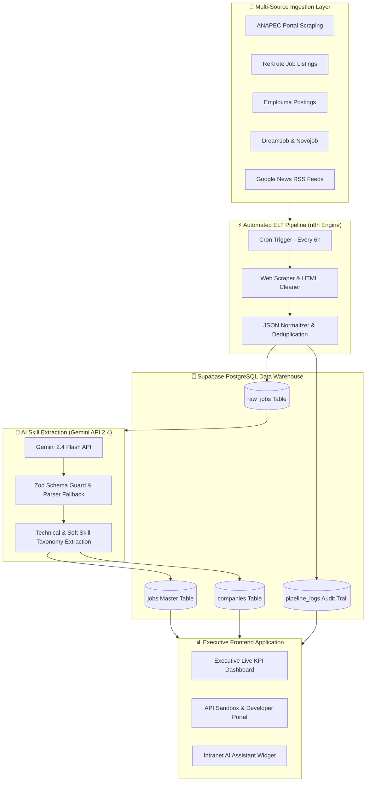
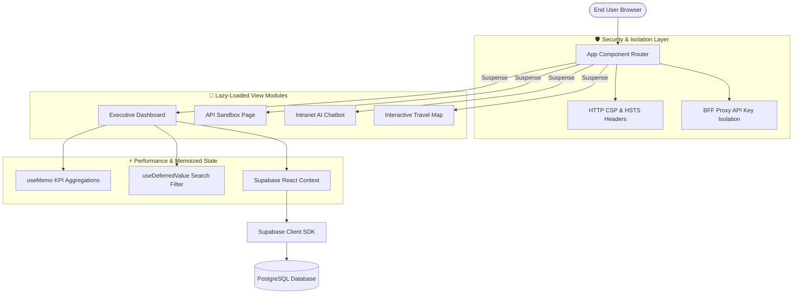

# Morocco Employment Intelligence Platform (MEIP)

[](https://github.com/meip/solana-breakpoint-2026/actions)
[](https://react.dev/)
[](https://vitejs.dev/)
[](https://www.typescriptlang.org/)
[](https://supabase.com/)
[](https://tailwindcss.com/)
[](https://ai.google.dev/)

> An automated data-ingestion, AI-driven skill extraction, and real-time analytical platform capturing, structuring, and visualizing national labor market dynamics across all 12 regions of the Kingdom of Morocco.

---

## 💡 Executive Overview

The **Morocco Employment Intelligence Platform (MEIP)** bridges the information asymmetry in the North African job market by aggregating live recruitment postings from major job portals (**ANAPEC, ReKrute, Emploi.ma, DreamJob, Novojob**). 

By leveraging **Gemini API 2.4** structured skill extraction pipelines combined with **n8n automated workflow orchestration**, MEIP transforms unstructured job descriptions into a queryable **Supabase PostgreSQL Data Warehouse**. The platform powers an executive analytics dashboard delivering real-time salary benchmarks, tech skill rankings, employer demand metrics, and granular regional labor telemetry.

```
       +-------------------------------------------------------------------------+
       |             Morocco Employment Intelligence Platform (MEIP)             |
       +-------------------------------------------------------------------------+
       |                                                                         |
       |  [ Multi-Portal Aggregation ]  -->  [ Gemini 2.4 Skill Extraction ]    |
       |         ANAPEC / ReKrute                 JSON Validation & Normalization|
       |                                                         |               |
       |                                                         v               |
       |  [ Executive Dashboard UI ]   <--  [ Supabase OLAP Data Warehouse ]    |
       |    React 19 + Dynamic Imports              PostgreSQL + RLS Security    |
       |                                                                         |
       +-------------------------------------------------------------------------+
```

---

## 🏗️ System Architecture & Data Flow

### 1. End-to-End ELT Data Pipeline Architecture



### 2. Frontend Application Architecture (React 19 + Vite)



---

## ⭐ Key Features Matrix

| Category | Feature Name | Description | Tech Implementation |
| :--- | :--- | :--- | :--- |
| **Data Aggregation** | Multi-Portal Ingestion | Ingests job postings from 5+ Moroccan recruitment portals with automated deduplication. | `n8n`, `Cheerio`, `PostgreSQL` |
| **Data Aggregation** | Live Telemetry Logs | Real-time audit trails recording extraction success rates, data hygiene, and portal execution logs. | `pipeline_logs` table, `RPC` |
| **AI Intelligence** | Gemini Skill Extraction | Extracts structured skill taxonomies, experience levels, and salary ranges from unstructured French/Arabic text. | `Gemini API 2.4`, `Zod`, `Vitest` |
| **AI Intelligence** | Intranet AI Assistant | Interactive AI widget answering labor market queries based on live database metrics. | `IntranetChatbot.tsx`, `Vector QA` |
| **Enterprise Security** | Row Level Security (RLS) | Restricts database mutations to `service_role` while enabling public read-only access. | `supabase_rls_policies.sql` |
| **Enterprise Security** | BFF API Key Isolation | Prevents client-side exposure of Gemini API and Supabase service keys. | `apiBffProxy.ts`, `Vite Security Headers` |
| **Real-Time Analytics** | Executive Dashboard | Interactive KPI cards, salary histograms, regional employment share, and company rankings. | `Recharts`, `useMemo`, `Framer Motion` |
| **Real-Time Analytics** | Interactive Map View | Visual map displaying regional job distribution across Casablanca, Rabat, Tangier, and all 12 prefectures. | `@vis.gl/react-google-maps` |

---

## 🗄️ Database Schema & Indexing Architecture

### Core Relational Schema Design

The MEIP data warehouse is designed following an **OLAP Star Schema** with specialized PostgreSQL indexes for rapid aggregation:

```sql
-- Master Ingested Jobs Table
CREATE TABLE jobs (
    id UUID PRIMARY KEY DEFAULT gen_random_uuid(),
    title TEXT NOT NULL,
    company TEXT NOT NULL,
    location TEXT NOT NULL,
    sector TEXT DEFAULT 'General',
    industry TEXT DEFAULT 'General',
    salary TEXT,
    experience TEXT DEFAULT 'Not Specified',
    contract_type TEXT DEFAULT 'CDI',
    work_type TEXT DEFAULT 'On-site',
    description TEXT,
    skills_json JSONB DEFAULT '[]'::jsonb,
    publication_date TIMESTAMPTZ,
    created_at TIMESTAMPTZ DEFAULT NOW()
);

-- B-Tree & GIN Indexes for Sub-10ms High-Frequency Queries
CREATE INDEX idx_jobs_location ON jobs USING btree (location);
CREATE INDEX idx_jobs_sector ON jobs USING btree (sector);
CREATE INDEX idx_jobs_company ON jobs USING btree (company);
CREATE INDEX idx_jobs_created_at ON jobs USING btree (created_at DESC);
CREATE INDEX idx_jobs_skills_gin ON jobs USING gin (skills_json);
```

### Row Level Security (RLS) Policy

```sql
-- Read-Only Policy for Anonymous Web Clients
CREATE POLICY "Public Read Access - jobs" 
  ON jobs FOR SELECT 
  TO anon 
  USING (true);

-- Service Role Key Required for Automated Ingestion
CREATE POLICY "Service Role Write Access - jobs" 
  ON jobs FOR ALL 
  TO service_role 
  USING (true) 
  WITH CHECK (true);
```

---

## 🛠️ Local Setup & Installation Guide

### Prerequisites
- **Node.js**: v20.x or v22.x LTS
- **npm**: v10.x or higher

### Step-by-Step Installation

1. **Clone the Repository**
   ```bash
   git clone https://github.com/meip/solana-breakpoint-2026.git
   cd solana-breakpoint-2026
   ```

2. **Configure Environment Variables**
   Create a `.env.local` file in the root directory:
   ```env
   VITE_SUPABASE_URL=https://dkmqcccyzfhytnpwzcdr.supabase.co
   VITE_SUPABASE_ANON_KEY=your_supabase_anon_key_here
   GEMINI_API_KEY=your_gemini_api_key_here
   GOOGLE_MAPS_PLATFORM_KEY=your_google_maps_key_here
   ```

3. **Install Dependencies**
   ```bash
   npm install
   ```

4. **Execute TypeScript Type Checking & Tests**
   ```bash
   npm run type-check
   npm run test
   ```

5. **Start Development Server**
   ```bash
   npm run dev
   ```
   Navigate to `http://localhost:3000` in your web browser.

6. **Build Production Application**
   ```bash
   npm run build
   ```

---

## 🚀 Deployment & CI/CD Pipeline

MEIP uses automated **GitHub Actions CI/CD** workflow (`.github/workflows/ci.yml`) triggering on pushes to `main` and `master`:

```
+-------------------------------------------------------------------------------+
|                            GitHub Actions CI Workflow                          |
+-------------------------------------------------------------------------------+
|                                                                               |
|  [ Checkout Code ] ──> [ Install Deps ] ──> [ Type Check: tsc --noEmit ]    |
|                                                              |                |
|  [ Production Dist ] <── [ Vite Build ] <── [ Vitest Unit Tests: vitest run ] |
|                                                                               |
+-------------------------------------------------------------------------------+
```

---

## 📄 License & Contact

Distributed under the **MIT License**. Engineered for the **Morocco Employment Intelligence Platform (MEIP)**.
