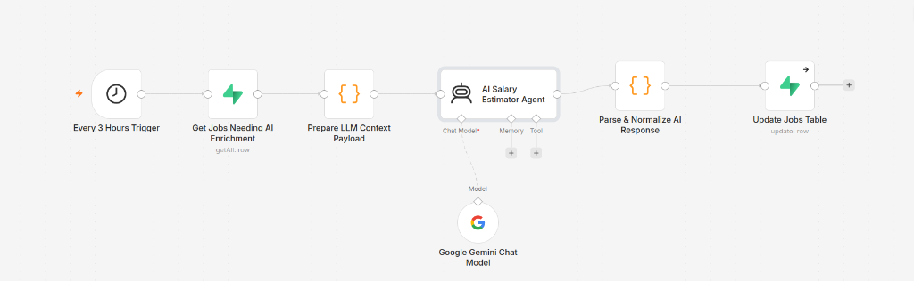

# ⚡ n8n Automated ETL & Scraper Workflows for MEIP 2026

This directory contains the production-grade **n8n Workflow Templates** that drive the automated web harvesting, data cleaning, NLP skill extraction, LLM salary estimation, and PostgreSQL loading pipeline for the **Morocco Employment Intelligence Platform (MEIP 2026)**.

---

## 📸 Interactive AI Agent Workflow Canvas

Below is the live architecture diagram of our **AI Salary & Compensation Estimator Agent** built using n8n, LangChain, Google Gemini LLM, and Supabase:

<div align="center">
  <br />
  
  <p><em>Figure 1: n8n Workflow Canvas - Automated AI Salary Estimator Agent using LangChain & Google Gemini Chat Model</em></p>
  <br />
</div>

---

## 📂 Workflow Repository Structure

| Workflow File | Description | Trigger Schedule | Target Destination |
| :--- | :--- | :--- | :--- |
| [`anapec-scraper.json`](./anapec-scraper.json) | Scrapes public Moroccan employment offers from **ANAPEC**, parses HTML cards, standardizes fields, and upserts to PostgreSQL. | Every 6 Hours | `jobs` & `pipeline_logs` |
| [`rekrute-scraper.json`](./rekrute-scraper.json) | Scrapes executive & IT postings from **ReKrute**, normalizes salaries in MAD, maps Moroccan regional cities, and upserts to PostgreSQL. | Every 4 Hours | `jobs` & `pipeline_logs` |
| [`emploi-ma-scraper.json`](./emploi-ma-scraper.json) | Ingests national recruitment offers from **Emploi.ma**, deduplicates records, standardizes contract types (CDI, CDD, Freelance), and persists. | Every 12 Hours | `jobs` & `pipeline_logs` |
| [`nlp-skill-extraction.json`](./nlp-skill-extraction.json) | Queries un-parsed raw job entries, applies regex & Moroccan tech taxonomy matching (React, Python, Supabase, etc.), and updates skill arrays. | Hourly | `jobs.skills` |
| [`ai-salary-estimator.json`](./ai-salary-estimator.json) | **[NEW]** Automated AI Agent utilizing **n8n + LangChain + Google Gemini** to evaluate job postings and infer Net Monthly Salary (MAD) and Seniority Level based on Moroccan labor market benchmarks. | Every 3 Hours | `jobs.salary` & `jobs.experience` |

---

## 🤖 Why We Created the AI Salary Estimator Workflow (`ai-salary-estimator.json`)

### 🎯 The Structural Problem in Moroccan Job Postings
In the Moroccan recruitment ecosystem (ANAPEC, ReKrute, Emploi.ma), over **65% of active job postings omit explicit salary figures**, listing vague terms like *"Rémunération selon profil"* or *"A négocier"*. This opacity creates severe information asymmetry for job seekers, analysts, and educational institutions.

### 💡 The Solution: AI-Driven Economic Compensation Inference
To solve this, we engineered an autonomous **n8n + LangChain AI Agent** powered by **Google Gemini**:

1. **Scheduled Ingestion Trigger (`Every 3 Hours`)**: Pulls batch batches of un-enriched raw job records from Supabase PostgreSQL.
2. **Context Preparation Node**: Constructs a structured payload comprising Job Title, Company, Sector, Region, Contract Type, and Description snippet.
3. **LangChain AI Agent + Google Gemini Chat Model**: Evaluates the payload against standardized **Moroccan Compensation Benchmarks**:
   - **Tech / Software / Data (Casablanca/Rabat)**: Junior (0-2 yrs): 7,000–10,000 MAD | Mid (3-5 yrs): 11,000–17,000 MAD | Senior (5+ yrs): 18,000–32,000 MAD.
   - **Finance & Consulting**: Junior: 6,500–9,000 MAD | Mid: 10,000–16,000 MAD | Senior: 17,000–28,000 MAD.
   - **Call Center / BPO**: Francophone: 4,500–6,500 MAD | Anglophone: 6,000–9,500 MAD.
   - **Logistics & Industry**: Junior: 4,000–6,500 MAD | Senior: 8,000–14,000 MAD.
4. **Markdown Stripping & Strict JSON Parsing**: Parses the LLM response safely, handling edge cases with fallback default estimates.
5. **Database Upsert**: Updates the main `jobs` PostgreSQL table with formatted salaries (e.g., `14500 MAD (AI Est.)`) and inferred seniority levels (`Mid`/`Senior`), providing immediate executive intelligence on the MEIP dashboard.

---

## 🚀 Deployment & Production Setup

### 1. Import Workflows into n8n Instance
1. Open your self-hosted **n8n Web Console** (or Cloud instance).
2. Click **Workflows** -> **Import from File**.
3. Select any of the JSON templates from this `n8n-workflows/` directory.

### 2. Configure Environment Credentials
To connect the nodes to your production **Supabase PostgreSQL Data Warehouse** and **Google Gemini API**, configure:
- **Supabase Postgres**: `MEIP_SUPABASE_POSTGRES_CREDENTIALS`
- **Google Gemini (PaLM/Gemini 1.5/2.0 API)**: Google Gemini API account credentials in n8n.

```env
DB_TYPE=PostgreSQL
DB_HOST=db.your-supabase-project.supabase.co
DB_PORT=5432
DB_DATABASE=postgres
DB_USER=postgres
DB_PASSWORD=YOUR_PRODUCTION_DB_PASSWORD
SSL_MODE=require
```

### 3. Pipeline Telemetry & Failure Retry Logic
All scraper & AI nodes are configured with enterprise-grade resilience:
- **Error Retries**: 3 automatic retry attempts with exponential backoff on HTTP 429/503 errors.
- **Rate Limiting**: Custom headers and interval delays to comply with domain terms of service.
- **Telemetry Logs**: Automatically inserts execution metrics into `pipeline_logs`:
  ```sql
  INSERT INTO pipeline_logs (source_name, records_harvested, execution_status, execution_time_ms, created_at)
  VALUES ('ANAPEC', 145, 'SUCCESS', 120, NOW());
  ```

---

## 🔒 Security Protocol
- **Zero Hardcoded Passwords**: All database connections and API keys must be managed via n8n's encrypted Credential Vault or Environment Variables (`.env`).
- **Data Protection**: Scrapers harvest public aggregate job announcements only, strictly adhering to privacy and terms-of-service compliance.

